<h1 align="center">Hi 👋, I'm Lakshmidath S</h1>
<h3 align="center">Turning ideas into products, one commit at a time 🚀</h3>

<p align="center">
  
</p>

<p align="center">
  
  
</p>

```text
while(alive){
    learn(Ai);
    build(Ai);
    solve_real_world_problems(Ai);
}
```

---

### 🚀 About Me

I'm a Computer Science Engineering student at **MACE Kothamangalam** who enjoys turning ideas into products.

I love exploring the intersection of **AI, software systems, blockchain, and software engineering**. Whether it's optimizing speech models for mobile devices, building decentralized applications, or solving algorithmic problems, I'm always interested in understanding how things work internally rather than just using them.

Currently, I'm focused on becoming a strong software engineer through consistent DSA practice, hands-on projects, and continuous learning.

---

### 🧠 What Drives Me

- 💡 Building products that solve real-world problems
- 🤖 AI & Large Language Models
- 🔗 Blockchain & Web3 applications
- ✨ Vibe coder
- 📊 Writing efficient algorithms
- 📚 Learning technologies from first principles

---

### 🛠 Current Focus

- 🔭 Solving Data Structures & Algorithms problems daily
- 🎯 Preparing for Software Engineering placements
- 🤖 Building AI-powered applications
- 🎙️ Exploring local LLMs, Whisper, and on-device AI
- 📡 Learning scalable backend architecture

---

### 🧮 NeetCode Progress

<!--NEETCODE:START-->
<p align="center">
  
</p>
<p align="center"><code>████████░░░░░░░░░░░░</code>  <b>114 / 300</b> (38%)</p>
<p align="center"><sub>Auto-updated from <a href="https://github.com/lakshmidath-S/neetcode-submissions">neetcode-submissions</a> · last synced 2026-09-04 UTC</sub></p>
<!--NEETCODE:END-->


---

### 🚧 Projects

<table>
<tr>
<td width="50%">

**🎓 CERTIFY**
Blockchain-based certificate verification platform using smart contracts, cryptographic hashing, QR verification, and digital signatures.

`React` `Node.js` `PostgreSQL` `Solidity` `Hardhat`

</td>
<td width="50%">

**🛒 RetailMind AI** *(In Progress)*
Smartphone-based billing assistant that understands Malayalam speech and generates English product names using optimized speech models and AI.

`Whisper` `Python` `Mobile AI` `LLMs`

</td>
</tr>
</table>

💻 More Coming Soon...
I enjoy experimenting with new technologies and turning interesting ideas into practical software.

---

### 💻 Tech Stack

**Languages**
<p>


</p>

**Backend**
<p>


</p>

**Frontend**
<p>


</p>

**Database**
<p>


</p>

**AI**
<p>


</p>

**Blockchain**
<p>


</p>

**Tools**
<p>


</p>

---

### 📈 Currently Learning

- System Design
- AI Engineering
- Distributed Systems
- Backend Development
- Mobile AI
- Cloud Technologies

---

### 🎯 2026 Goals

- [ ] Crack a Software Engineering role
- [ ] Reach 300+ quality DSA problems solved — [live progress ↑](#-neetcode-progress)
- [ ] Build production-ready AI applications
- [ ] Contribute to open source
- [ ] Keep learning something new every week

---

### 📊 GitHub Stats
<p align="center">
  
  
</p>
<p align="center">
  
</p>

---

<p align="center">
  <i>"I don't just want to write code—I want to build technology that solves meaningful problems."</i>
</p>

<p align="center">
  
</p>

<p align="center">
  <a href="https://www.linkedin.com/in/lakshmidath-s-936236357/"></a>
  <a href="mailto:lakshmidathlachu@gmail.com"></a>
</p>
